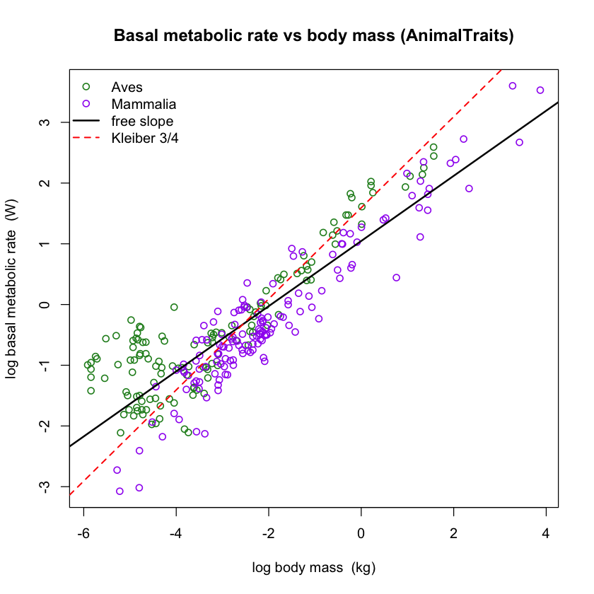
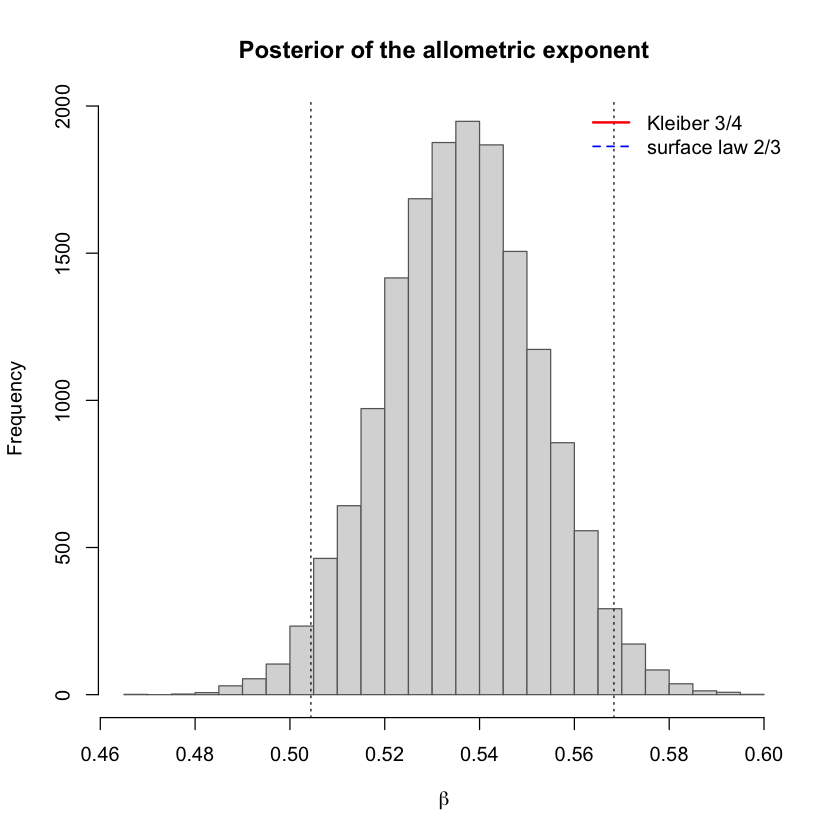
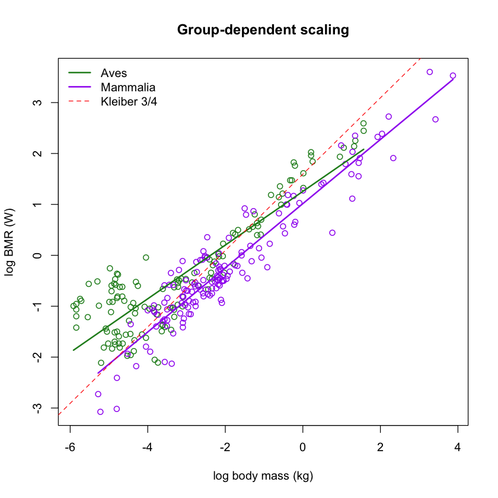
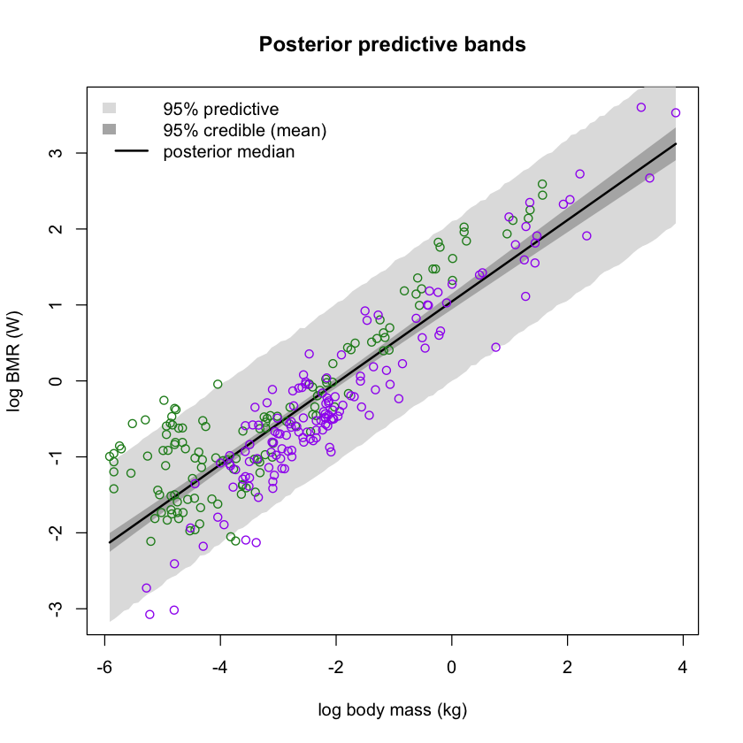

# Bayesian Analysis of Kleiber's Law

Does basal metabolic rate scale universally as body mass to the power of 3/4? This project tests Kleiber's law with Bayesian regression, a hand-coded Gibbs sampler, and 279 bird and mammal observations from the AnimalTraits database.



## Project highlights

- Implemented a conjugate Gibbs sampler from scratch in R.
- Compared a fixed 3/4 model, a pooled free-slope model, and a group-dependent model.
- Assessed four MCMC chains with trace plots, effective sample sizes, and Gelman-Rubin diagnostics.
- Cross-checked the custom sampler independently with JAGS.
- Used DIC and posterior predictive checks for model comparison and validation.
- Produced uncertainty-aware estimates and predictions rather than point estimates alone.

## Main findings

| Result | Posterior estimate | Interpretation |
|---|---:|---|
| Pooled exponent | 0.536 (95% CrI: 0.504-0.568) | The pooled relationship is substantially shallower than 3/4. |
| P(beta > 0.75) | 0 | Kleiber's exponent is unsupported in this curated basal subset. |
| Bird exponent | 0.527 (95% CrI: 0.486-0.569) | Birds show a shallower within-group slope. |
| Mammal exponent | 0.630 (95% CrI: 0.588-0.672) | Mammals scale more steeply than birds. |
| P(beta_mammal > beta_bird) | approximately 1 | The group difference is strongly supported. |
| Predicted BMR at 1 kg | 2.83 W (95% PI: 0.99-7.89) | Individual predictions remain much wider than uncertainty in the mean. |

Model comparison also favored the group-dependent model: DIC decreased from 570.9 for the fixed 3/4 model, to 438.5 for the pooled free-slope model, and to 365.9 for the group-dependent model.





## Repository contents

- [`notebooks/kleiber_law_bayesian_analysis.ipynb`](notebooks/kleiber_law_bayesian_analysis.ipynb): complete R analysis with saved outputs
- [`report/allometric_scaling_kleiber_law.pdf`](report/allometric_scaling_kleiber_law.pdf): full technical report
- [`data/animaltraits_bmr.csv`](data/animaltraits_bmr.csv): analysis-ready subset used by the notebook
- [`scripts/prepare_data.R`](scripts/prepare_data.R): reproducible filtering script for the original AnimalTraits file
- [`assets/`](assets): selected figures for quick review
- [`LINKEDIN.md`](LINKEDIN.md): ready-to-copy LinkedIn project entry

## Methods

The analysis models log basal metabolic rate as a linear function of log body mass. Three Gaussian Bayesian regression models are compared:

1. **Fixed Kleiber model:** exponent fixed at 0.75.
2. **Free-slope model:** a single exponent is estimated from the data.
3. **Group-dependent model:** separate intercepts and slopes are estimated for Aves and Mammalia.

The sampler uses normal conditional posteriors for regression coefficients and an inverse-gamma conditional posterior for residual variance. Each model uses four chains of 20,000 iterations with 4,000 burn-in iterations. Posterior predictive checks evaluate dispersion and predictive coverage.



## Reproduce the analysis

Requirements:

- R 4.3 or newer
- JAGS system runtime
- R packages `coda` and `rjags`
- JupyterLab with an R kernel for the notebook interface

From the repository root:

```bash
Rscript scripts/install_packages.R
jupyter lab notebooks/kleiber_law_bayesian_analysis.ipynb
```

The cleaned dataset is included, so the notebook can run without downloading the original file. To rebuild it from the source data, download `observations.csv` into `data/raw/` and run:

```bash
Rscript scripts/prepare_data.R
```

See [`data/README.md`](data/README.md) for provenance, licensing, and the exact source link.

## Scope and limitations

This result concerns a curated basal-metabolic-rate subset, not every organism or metabolic condition. The observations are not phylogenetically independent, some species occur more than once, and the available records are not a random sample of all endotherms. A fuller model could incorporate phylogenetic covariance and species-level random effects.

## Author

Amirmohammad Saiedi Saber

## License note

The source AnimalTraits data are released under CC0 1.0. No license has yet been assigned to the project code and report; permission is therefore not automatically granted to reuse those materials.
